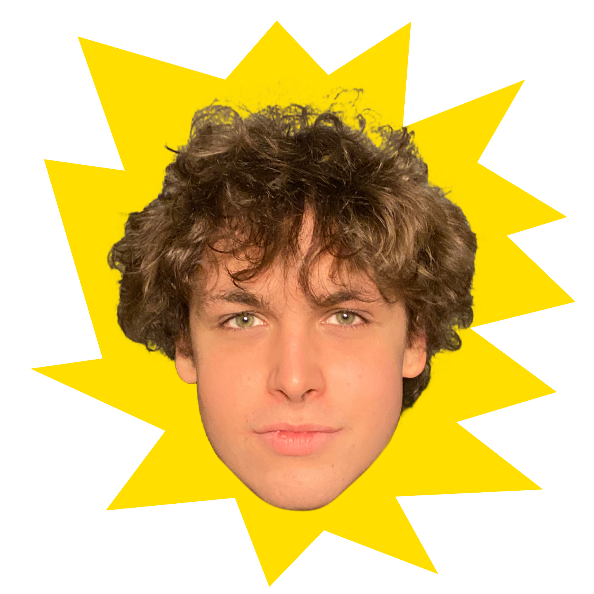

# Illya Markov
    
Illya Markov is the star at the center of the Illya System. This star is a nearly perfect sphere of hot plasma, heated to incandescence by nuclear fusion reactions in its core... and rage from debugging bad code.

|  | 
|:--:| 
| *Proof that I am the center of the star system :)* |

## What's going on here?

Alright, so here's what's up: I make a bunch of projects and a lot of them go completely uncategorized and unnoticed. For example: much of my software exists on slowly dying hard drives never to reach any sort of public space. Lots of my hardware projects are only developed to completion, and once that happens, are scavenged for parts immediately. Almost all my work will probably never get seen by anyone beyond some bots scraping random web pages, or someone who just so happens to talk to me while I'm still working on a given project. I was told to put my projects in the open-source space, but I often neglect to do so because... well... I don't *wanna*. This site aims to help with this!

I have made a very simple way for me to add projects to this site with an interesting layout and a quick way for others to see what I'm working on. Watch out for new changes, like a "table of contents" for how to read the site. I also plan to:

* Add moons for "subprojects" of a given project
* Satellites orbiting each planet which will show you how many people are following that project (and allow you to follow it as well)
* Maybe even many star systems for other devs to show off the projects they are working on!

There will likely be **many** planets in the Illya star system, most of which will be websites or software, as I have other plans for hardware stuff. 

  

P.S. This is the first project I did in React! My takeaway? Suuuuper bloated. 1.5k packages: ~300MB just to start a project? Very easy, but yucky under the hood. Eh, good for quickly making pretty sites, I guess. PERFECT for webdev dopamine junkies or folks who only care about money!

 

## Quick Facts
- **Age**: 20 years
- **Type**: ...White?
- **Diameter**: 192 cm
- **Mass**: Like 80kg?
- **Surface Temperature**: 36.6°C I guess